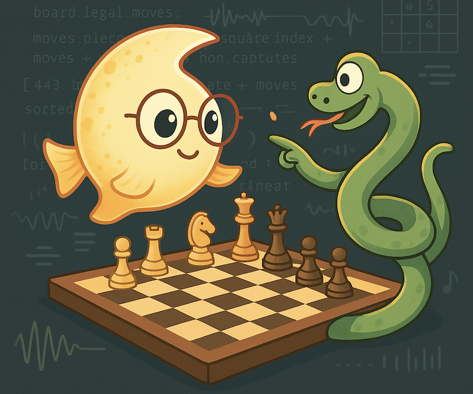

<p align="center">
    
</p>

# Moonfish Engine ([~2000 Elo Rating Lichess.org](https://lichess.org/@/moonfish_bot))

Moonfish is a didactic Python chess engine designed to showcase parallel search algorithms and modern chess programming techniques. Built with code readability as a priority, Moonfish makes advanced concepts easily accessible providing a more approachable alternative to cpp engines. 

The engine achieves approximately ~2000 Elo when playing against Lichess Stockfish bots (beats level 5 and loses to level 6) and includes comprehensive test suites including the Bratko-Kopec tactical test positions.

## Features

### Search Algorithms
- **Alpha-Beta Pruning** - Negamax with α-β cutoffs
- **Lazy SMP** - Shared memory parallel search utilizing all CPU cores  
- **Layer-based Parallelization** - Distributing work at specific search depths
- **Null Move Pruning** - Skip moves to detect zugzwang positions
- **Quiescence Search** - Extended search for tactical positions

### Evaluation & Optimization
- **PeSTO Evaluation** - Piece-square tables (PST) with tapered evaluation. [Using Rofchade's PST](https://talkchess.com/viewtopic.php?t=68311&start=19).
- **Transposition Tables** - Caching to avoid redundant calculations
- **Move Ordering** - MVV-LVA (Most Valuable Victim - Least Valuable Attacker)
- **Syzygy Tablebase** support for perfect endgame play
- **Opening Book** integration (Cerebellum format)

### Engine Interfaces
- **UCI Protocol** - Compatible with popular chess GUIs
- **Web API** - RESTful interface for online integration
- **Lichess Bot** - Ready for deployment on Lichess.org

## Installing dependencies

```bash
git clone https://github.com/luccabb/lazy_smp.git
cd lazy_smp
pip install -r requirements.txt
```
## Running the Engine

### 1. Running as an [UCI](http://wbec-ridderkerk.nl/html/UCIProtocol.html) Compatible Engine

```shell
# to get available options
$ python main.py --help
# starts the engine with default options
$ python main.py
```

### 2. Running as a Web Server

```
python api.py
```

## Running Tests


### Unit Tests

Unit tests are testing the basic functionality of the engine,
with key positions and moves.

```
python -m unittest tests/test.py
```

### [Bratko-Kopec Test](https://www.chessprogramming.org/Bratko-Kopec_Test)

[Bratko-Kopec](https://www.chessprogramming.org/Bratko-Kopec_Test) tests the engine
performance in terms of time and strenght.

```
python -m tests.test_bratko_kopec
```

## Lichess-bot Python Bridge

This engine implements the UCI protocol and can be used as a bot on [Lichess](https://lichess.org). You can use the python bridge between Lichess Bot API and the engine: [https://github.com/ShailChoksi/lichess-bot](https://github.com/ShailChoksi/lichess-bot).

To run it as a bot you'll need to produce a python executable. [PyInstaller](https://pyinstaller.readthedocs.io/en/stable/) can produce it by running the following command:

```
python3 -m PyInstaller main.py
```

This creates a `build` and `dist` folder. The `dist` folder contains the main executable in a folder called `main`. All the files inside `main` need to be copied over to `/lichess-bot/engines` for it to work. You can checkout [/lichess](lichess/README.md) for further lichess setup.

## Configuration Options

| Parameter | Description | Default | Options |
|-----------|-------------|---------|---------|
| `--mode` | Engine Mode | `uci` | `uci`, `api` |
| `--algorithm` | Search algorithm | `alpha_beta` | `alpha_beta`, `lazy_smp`, `parallel_alpha_beta_layer_1` |
| `--depth` | Search depth | `3` | `1-N` |
| `--null-move` | Whether to use null move pruning | `False` | `True`, `False` |
| `--null-mov-r` | Null move reduction factor | `2` | `1-N` |
| `--quiescence-search-depth` | Max depth of quiescence search | `3` | `1-N` |
| `--syzygy-path` | Tablebase directory | `None` | Valid path |
| `--hash-size` | Transposition table size (MB) | `64` | `1-1024` |


## Contributing

We welcome contributions, feel free to open PRs/Issues! Areas of interest:
- New search algorithms
- Improved evaluation functions
- Time constrained search (e.g. find the best move in 40s)
- Additional test positions
- Github CI testing
- Different evaluation functions
- Neural Net integration
- Performance benchmarking on different hardware

## References

- [Chess Programming Wiki](https://www.chessprogramming.org/)
- [python-chess library](https://python-chess.readthedocs.io/)
- [Lazy SMP Algorithm](https://www.chessprogramming.org/Lazy_SMP)
- [UCI Protocol Specification](http://wbec-ridderkerk.nl/html/UCIProtocol.html)
- [Rofchade](https://talkchess.com/viewtopic.php?t=68311&start=19)

## License

MIT License - see [LICENSE](LICENSE) file for details.
